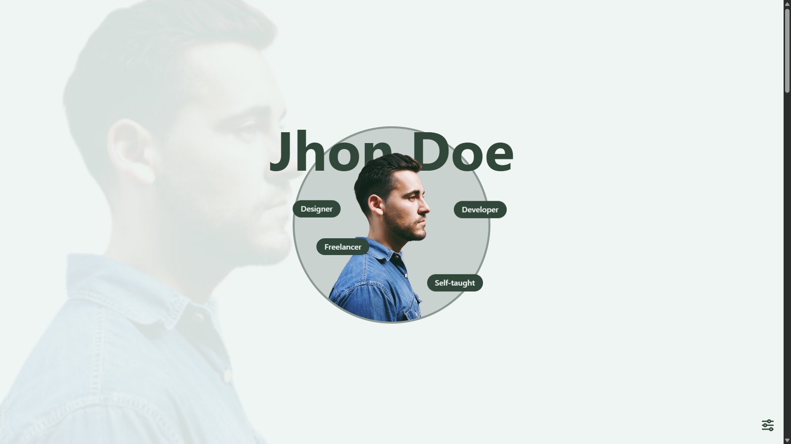

# 🧑‍💻 One Page CV



Un portfolio personal minimalista y profesional que funciona como CV online de una sola página. Creado con tecnologías web fundamentales: HTML, CSS y JavaScript vanilla.

## ✨ Características principales

🌐 **Multi-idioma**: Cambia entre idiomas fácilmente - toda la información se gestiona a través de archivos .json independientes, sin necesidad de tocar el código HTML.

🎨 **Personalización visual**:
- Modo **dark/light** para adaptarse a las preferencias del usuario
- **3 esquemas de colores** diferentes para darle tu toque personal
- Diseño completamente **responsivo** que se ve perfecto en cualquier dispositivo.

⚡ **Fácil de usar**:
- **Configuración sin código**: Solo editá los archivos JSON con tu información personal
- **Plug & play**: Descargá, personalizá y publicá
- **Liviano y rápido**: Sin frameworks pesados, solo tecnologías web puras

### 🎯 Perfecto para
Desarrolladores, diseñadores, freelancers o cualquier profesional que necesite una presencia web rápida y profesional sin complicaciones técnicas. Ideal como primer proyecto o como alternativa minimalista a portfolios más complejos.

---

### 📁 Estructura del proyecto

```plaintext
📦 one-page-cv/
├── index.html
├── assets/
│ ├── css/
│ ├── images/
│ ├── js/
│ └── json/
│ ├── es.json
│ └── en.json
└── README.md
```

## 📩 Formulario de contacto

Para activar el formulario, debés registrarte en [Formspree](https://formspree.io/) (gratuito) y obtener tu endpoint. Luego reemplazá el valor del `action` en el formulario por tu URL personalizada, por ejemplo:

```html
<form action="https://formspree.io/f/xxxxxxxx" method="POST">
```

---

## 🗂️ Archivos JSON

El contenido de la página se gestiona desde archivos `.json` ubicados en:  
`/assets/json/`

Cada archivo representa un idioma:
- `es.json` – Español
- `en.json` – Inglés

### 📌 Ejemplo de contenido en `es.json`:
```json
{ 
  "Title": "One Page CV — {TU_NOMBRE}",
  "PersonName": "{TU_NOMBRE}",
  "NavbarItems": {
    "sobre_mi": "Sobre mí",
    "tecnologias": "Tecnologías",
    "proyectos": "Proyectos",
    "contacto": "Contacto"
  },
  "Traits": [
    "Habilidad1",
    "Habilidad2",
    "Habilidad3",
    "Habilidad4"
  ],
  "AboutMe": {
    "title": "Sobre mi",
    "content": "<p>Tu contenido</p>"
  },
  "Categories": {
    "1": "Frontend",
    "2": "Backend",
    "3": "Database",
    "4": "Other"
  },
  "Technologies": {
    "title": "Tecnologías",
    "list": [
      { 
        "category": "1",
        "icon": "./assets/images/technologies/example.svg",
        "text": "example"
      }
    ]
  },
  "Projects": {
    "title": "Proyectos",
    "projects": [
      {
        "title": "",
        "description": "",
        "cover": "",
        "link": ""
      }
    ]
  },
  "Contact": {
    "title": "Contacto",
    "content": "¿Querés hablar sobre un proyecto, mejorar tu web o simplemente decir hola?",
    "fields": {
      "nombre": "Nombre:",
      "correo": "Correo:",
      "mensaje": "Mensaje:",
      "enviar": "Enviar"
    }
  }
}
```

### 🚀 Cómo usar
Cloná el repositorio:
```bash
git clone https://github.com/proyectos-random-x/OnePageCV.git
cd OnePageCV
```
Abrí index.html en tu navegador.

Para cambiar el contenido, editá los archivos en /assets/json/.

Para cambiar de idioma de forma manual:
```html
<!-- Cambiar por lang="en", lang="pt", etc. -->
<html lang="es" data-scheme="light" data-color="default">
```

### 🌍 Publicación
Podés subir este proyecto directamente a:
- GitHub Pages
- Netlify
- Vercel

### 🤝 Créditos
Hecho con cariño por Joel.
Inspirado en buenas prácticas, accesibilidad y ganas de dejar el código más prolijo que una libreta nueva 🧼📘.

### 📃 Licencia
MIT – Usalo, modificalo y compartilo como quieras.